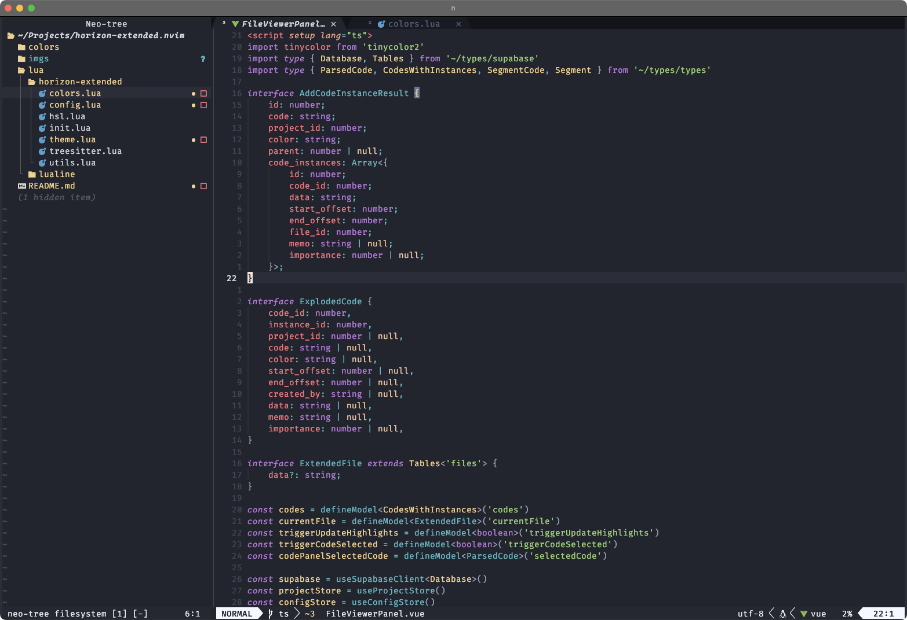
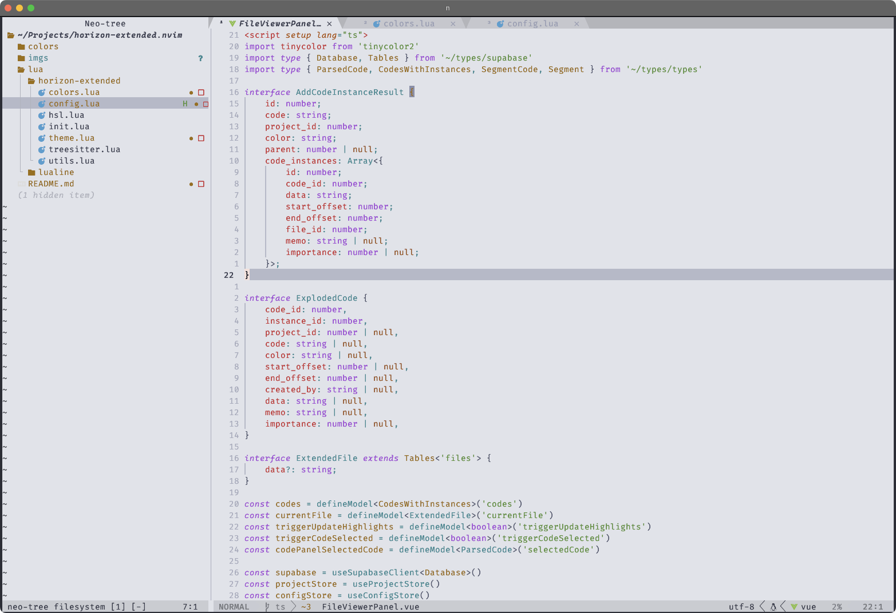

<h3 align="center">
</br>
Horizon Extended (nvim)
</h3>

<p align="center">
Bringing over the <i>mildly</i> popular <a href="https://github.com/lancewilhelm/horizon-extended">Horizon Extended VSCode theme</a> to Neovim.
</p>

# Styles

<details>
    <summary>neo</summary>

</details>
<details>
    <summary>beam</summary>

</details>
<details>
    <summary>ray</summary>

</details>

*The previews above were taken in Kitty with FiraCode Nerd Font and CaskaydiaCove Nerd Font SemiLight Italic*
# Features

- Two dark modes (neo being a very slight update to the original VSCode theme), and one light mode
- Syntatic highlighting via LSP and tree-sitter for most of the popular languages
- Plugin support for common plugins.

# Installation

[lazy.nvim](https://github.com/folke/lazy.nvim)
```lua
{ "lancewilhelm/horizon-extended.nvim", priority = 1000 }
```

# Usage

```vim
colorscheme horizon-extended
```

```lua
vim.cmd.colorscheme "horizon-extended"
```

# Configuration

There is no need to call setup if you do not want to change the default options and settings.

```lua
require("horizon-extended").setup({
	style = "neo", -- style of the theme
	transparent = false, -- sets the background to be transparent
	terminal_colors = false, -- builtin terminal theme colors
	enable_italics = true, -- enable italics for the theme
	styles = {
		comments = { italic = true, bold = false }, -- change the style of the comments
		keywords = { italic = true, bold = false },
		functions = { italic = false, bold = false },
		variables = { italic = false, bold = false },
		string = { italic = false, bold = false },
		delimiter = { italic = false, bold = false },
		underline = false, -- enable underlines
		undercurl = true, -- enable undercurls
	},
})
```

# Integrations

This theme supports several common plugins, but this list is not exhaustive yet becauset this is the first version of the theme. Some highlights may not be perfect with the plugins. If you find what you think is a bug with the theme, please submit and issue.

Here is a list of plugins (in no particular order) that have been tested with this theme and should work out of the box (some of them may not have any theming but I am just listing all that have been in my config):

- [neo-tree.nvim](https://github.com/nvim-neo-tree/neo-tree.nvim)
- [nvim-treesitter](https://github.com/nvim-treesitter/nvim-treesitter) 
- [dashboard-nvim](https://github.com/nvimdev/dashboard-nvim)
- [nvim-lint](https://github.com/mfussenegger/nvim-lint)
- [nvim-cmp](https://github.com/hrsh7th/nvim-cmp)
- [nvim-autopairs](https://github.com/windwp/nvim-autopairs)
- [Comment.nvim](https://github.com/numToStr/Comment.nvim)
- [mini.ai](https://github.com/echasnovski/mini.ai)
- [mini.surround](https://github.com/echasnovski/mini.surround)
- [lazydev.nvim](https://github.com/folke/lazydev.nvim)
- [nvim-spectre](https://github.com/nvim-pack/nvim-spectre)
- [nvim-notify](https://github.com/rcarriga/nvim-notify)
- [nvim-web-devicons](https://github.com/nvim-tree/nvim-web-devicons)
- [indent-blankline.nvim](https://github.com/lukas-reineke/indent-blankline.nvim)
- [lualine.nvim](https://github.com/nvim-lualine/lualine.nvim)
- [noice.nvim](https://github.com/folke/noice.nvim)
- [bufferline.nvim](https://github.com/akinsho/bufferline.nvim)
- [mini.hipatterns](https://github.com/echasnovski/mini.hipatterns)
- [nvim-lspconfig](https://github.com/neovim/nvim-lspconfig)
- [plenary.nvim](https://github.com/nvim-lua/plenary.nvim)
- [vim-sleuth](https://github.com/tpope/vim-sleuth)
- [which-key.nvim](https://github.com/folke/which-key.nvim)
- [gitsigns.nvim](https://github.com/lewis6991/gitsigns.nvim)
- [trouble.nvim](https://github.com/folke/trouble.nvim)
- [undotree](https://github.com/mbbill/undotree)
- [vim-tmux-navigator](https://github.com/christoomey/vim-tmux-navigator)
- [vim-signature](https://github.com/kshenoy/vim-signature)
- [better-ts-errors.nvim](https://github.com/OlegGulevskyy/better-ts-errors.nvim)
- [markdown-preview.nvim](https://github.com/iamcco/markdown-preview.nvim)
- [telescope.nvim](https://github.com/nvim-telescope/telescope.nvim)
- [conform.nvim](https://github.com/stevearc/conform.nvim)
